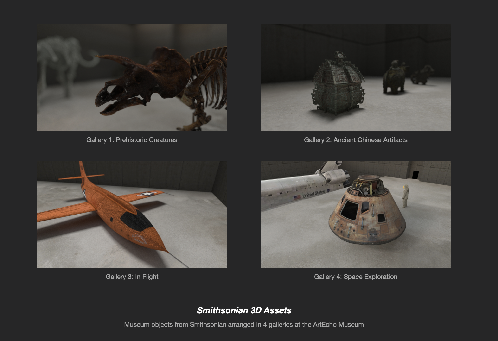
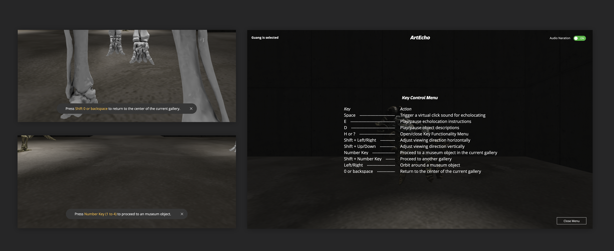

<iframe frameborder="0" allowfullscreen="" scrolling="no" allow="autoplay;fullscreen" src="https://onelineplayer.com/player.html?autoplay=true&autopause=false&muted=true&loop=false&url=https%3A%2F%2Fwww.dropbox.com%2Fs%2F3o3ir7nfyi94rxj%2Flong.mp4%3Fraw%3D1&poster=&time=true&progressBar=true&overlay=true&muteButton=true&fullscreenButton=true&style=light&quality=auto&playButton=true" style="position: absolute; height: 100%; width: 100%; left: 0px; top: 0px;"></iframe>

Art Echo is a web-based virtual reality experience that reveals the acoustic attributes of 3D objects in the Smithsonian’s Open Access collections while moving through periods of the history of Earth and some of its inhabitants. In this virtual gallery people can experience the objects and their stories through imagery, sound, and simulated echolocation based on the teachings of Thomas Tajo, a blind echolocation user and teacher.

Art Echo is available on desktop only. For the best experience, please use either Chrome or Firefox. Safari is not supported at this time. For hearing people, we advise wearing headphones.

Video, Photo Credit: Jerry Tan

